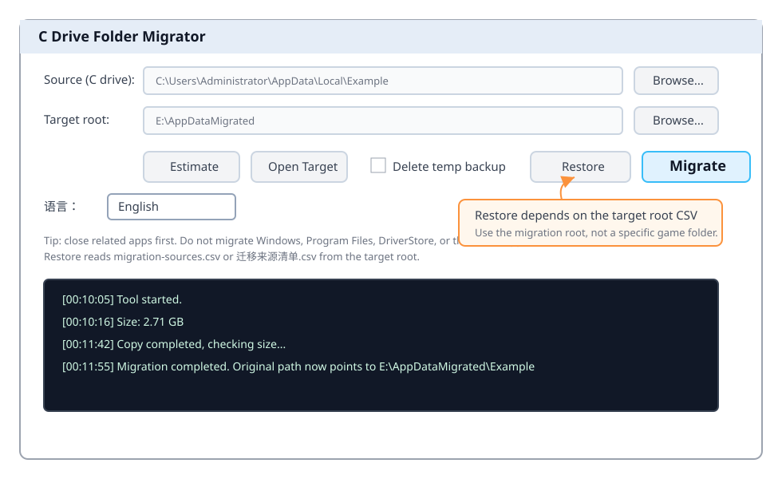
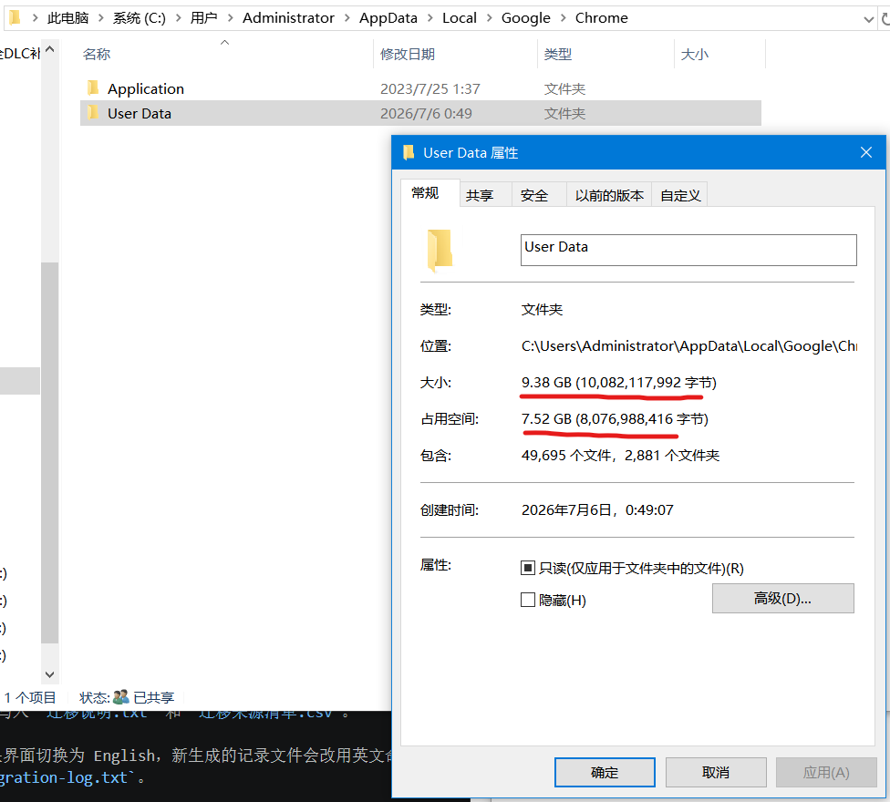
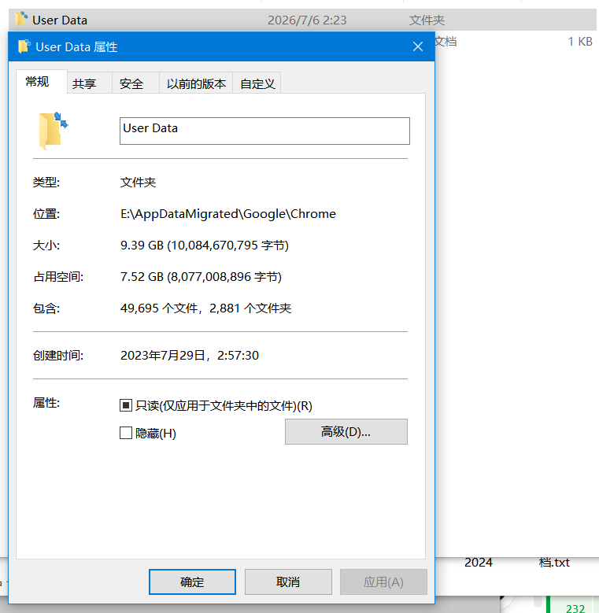
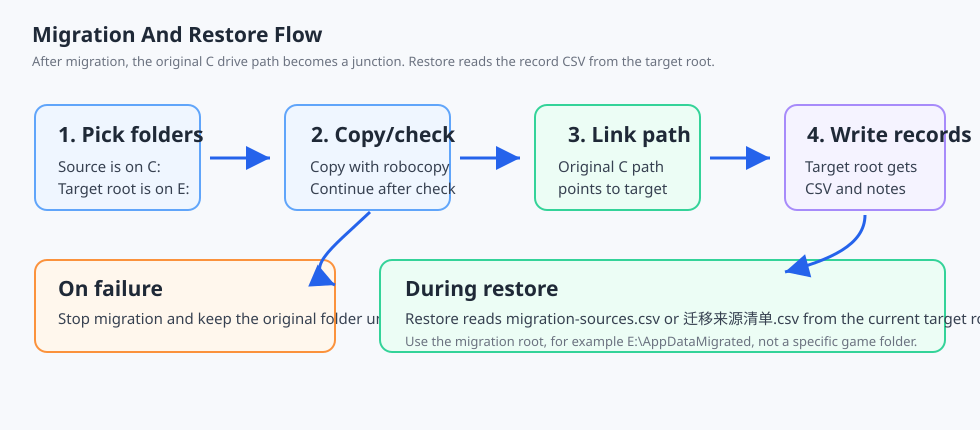
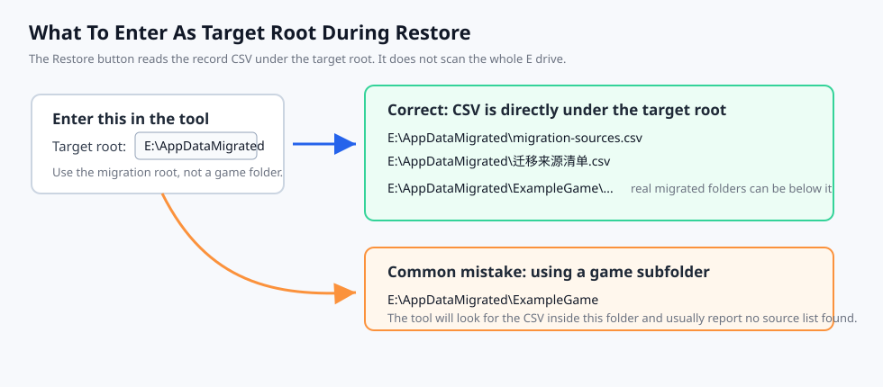

# C Drive Folder Migrator

Language: English | [中文](README.md)

Free up your C drive by moving game saves, browser profiles, and large app configuration folders to another drive while keeping the original paths working.

This is a portable Windows utility for moving known large user-data folders from the C drive to another drive while keeping the original path working through a directory junction.

Applications still access the original C drive path, but the real data is stored on the target drive.

## Supported Systems

- Recommended: Windows 10 and Windows 11.
- Also suitable for: Windows Server 2016/2019/2022 with Desktop Experience.
- Requires: Windows PowerShell 5.1, .NET Framework WinForms, `robocopy`, and `mklink`. These are usually included with modern Windows.
- Not supported: macOS and Linux.
- Not recommended: unsupported legacy systems such as Windows 7/8/8.1. They may work in some environments, but compatibility is not guaranteed.

For game saves, browser data, and app settings under the current user profile, administrator rights are usually not required. Do not use this tool for system folders, driver stores, or folders that should be maintained by Windows.



## Good Use Cases

- Game save folders
- Browser user profile folders
- Large application configuration folders
- Known `AppData` subfolders
- `Saved Games` or `Documents\My Games` style user data folders

## Real-World Example

The screenshots below show a Chrome `User Data` migration. This folder stores browser settings, cache, extensions, login state, and user profiles. It often contains many files and can grow large on the C drive.

In this example, Chrome user data uses about 7.52 GB of disk space. After migration, Chrome can still use the original C drive path, while the real data lives on the E drive. In other words, seeing the C drive path still exist does not mean the migration failed; it is the junction entry kept for the application.

| C drive entry | Real folder on E drive |
| --- | --- |
|  |  |

This example highlights two points:

1. Large browser profile folders can be migrated to free C drive space.
2. After migration, verify the junction and the target folder instead of judging only by the path shown in the Properties window.

## Do Not Migrate

- `C:\Windows`
- `C:\Program Files`
- `C:\Program Files (x86)`
- `C:\Windows\System32\DriverStore`
- The entire `C:\Users\<user>\AppData` folder
- Any system folder you do not clearly understand

## Before You Migrate

If you are not sure what a folder belongs to or whether it is safe to move, ask an AI assistant with the full path first, or search to confirm what the folder is used for. Be extra careful with `AppData`, launchers, browsers, drivers, and system-related folders. Do not migrate a folder only because it looks large.

A useful prompt:

```text
What Windows app uses this folder, and is it suitable to migrate to E drive?
C:\Users\<user>\AppData\Local\ExampleFolder
```

## Workflow



The tool works in this order:

1. Copy the source folder to the target drive.
2. Perform a basic size check.
3. Move the original folder to a temporary backup.
4. Create a junction at the original path.
5. Write `migration-notes.txt`, `migration-sources.csv`, and `migration-log.txt` when the interface language is English.

If copying or validation fails, the tool stops before replacing the original folder.

## How To Use

1. Double-click `启动_C盘文件夹迁移工具.cmd`.
2. Choose the source folder on the C drive.
3. Choose a target root folder, for example `E:\AppDataMigrated`.
4. Click `Estimate`.
5. Close the related app, game, or browser.
6. Click `Migrate`.
7. Test the related app after migration.

## Language Switch

Use the `Language` dropdown in the main window to switch between Chinese and English.

The switch updates the main labels, buttons, prompts, restore dialog text, and newly generated record file names. Existing log lines and older record files are not renamed.

## Backup Option

By default, the tool keeps a temporary backup beside the original folder, such as:

```text
Example_backup_migrated_20260706_010000
```

After confirming that the app works, you can delete the backup manually.

If you are confident, enable `Delete temp backup` to free C drive space immediately.

## Restore Migration

The tool includes a `Restore` button. It moves the real folder on the target drive back to the original C drive path.

Restore does not scan the whole target drive. It only reads the migration CSV in the current `Target root` folder.



For example, if `Target root` is:

```text
E:\AppDataMigrated
```

English mode tries this file first:

```text
E:\AppDataMigrated\migration-sources.csv
```

Chinese mode tries this file first:

```text
E:\AppDataMigrated\迁移来源清单.csv
```

For compatibility, the tool also checks the other language's file name if the current language's CSV is not found. This means English mode can still restore from older Chinese records, and Chinese mode can restore from English records.

To restore:

1. Close the related app.
2. Set `Target root` to the same root folder used during migration, for example `E:\AppDataMigrated`.
3. Click `Restore`.
4. Select a migration record from `migration-sources.csv` or `迁移来源清单.csv`.
5. Confirm the operation.

If the tool says no migration source list was found, the `Target root` is usually wrong. Use the migration root folder, not a specific game folder. For example, if the record is `E:\AppDataMigrated\migration-sources.csv`, set `Target root` to `E:\AppDataMigrated`.

To make restore records discoverable:

1. Keep `migration-sources.csv` or `迁移来源清单.csv` directly under the migration root folder.
2. If you manually move the target root, move the CSV record file with it.
3. If you manually move only one migrated subfolder, update that row's `MigratedPath` in the CSV. Otherwise the tool may not find the real folder, or it may stop because the safety check fails.
4. Do not put the CSV inside a specific game folder unless that game folder itself is the target root shown in the tool.

After a successful restore, the tool also checks for temporary backups it created beside the original path, for example:

```text
Example_backup_migrated_20260706_010000
```

If such a backup is found, the tool deletes it so the C drive does not keep an old duplicate. It only deletes folders that match the `_backup_migrated_yyyyMMdd_HHmmss` naming pattern and are next to the original path. If the backup is locked and cannot be deleted, the log asks you to check it manually.

The tool checks that:

- The original path is on the C drive.
- The migrated path is not on the C drive.
- The original path is a junction.
- The junction target matches the migration record.

If any check fails, the restore is stopped.

## Manual Verification

After migration, the original path still appears to exist. That is expected.

You can verify it with PowerShell:

```powershell
Get-Item "C:\Original\Path" | Select FullName,Attributes,Target
```

If you see:

```text
Attributes : Directory, ReparsePoint
Target     : E:\Target\Path
```

the original path is a junction and the real data is on the target drive.

## When Uninstalling Migrated Apps Or Games

This tool is portable and has no installer or uninstaller. This section is about uninstalling an app, game, or browser whose data folder has been migrated.

If that app's own uninstaller has options like `delete user data`, `delete settings`, or `delete browser data`, it may follow the junction and delete the real data on the target drive.

If you want to keep the migrated data, restore the migration first, or manually disconnect the junction and back up the target folder before uninstalling that app.

## Notes

- Use a fixed internal drive as the target. Avoid removable drives.
- SSD targets are preferred for browser profiles and frequently written app data.
- Do not use this for driver stores or system folders.

