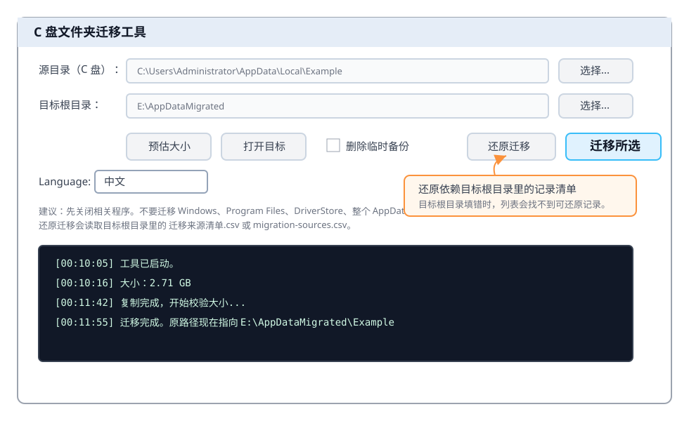
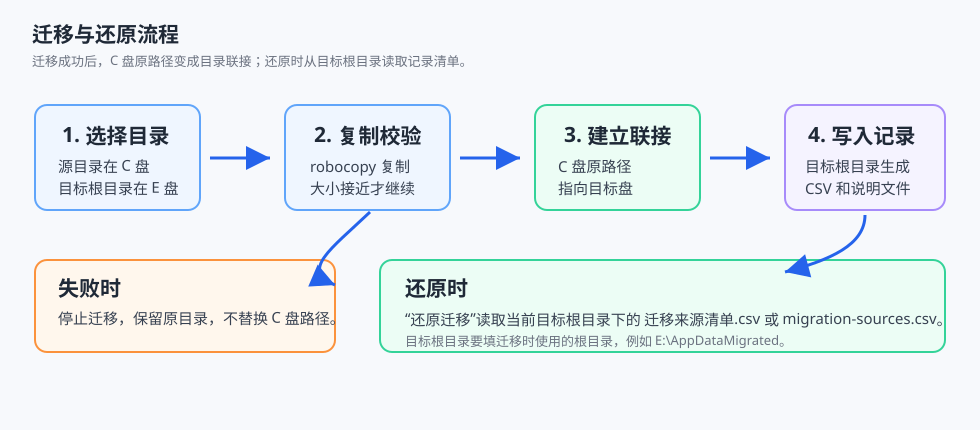
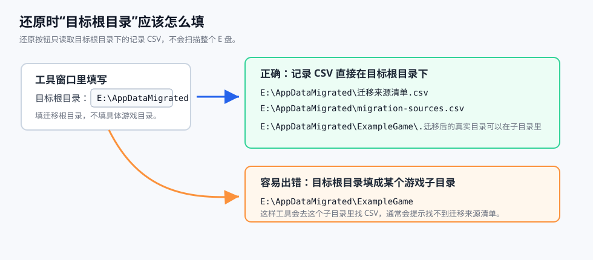

# C 盘文件夹迁移工具

为 C 盘减负，把游戏存档、浏览器用户数据和大型软件配置迁移到其他盘，同时保留原来的访问路径。

这是一个免安装的 Windows 小工具，用来把明确的大型用户数据目录从 C 盘迁移到其他盘，并在原位置创建目录联接。

程序仍然访问原来的 C 盘路径，但真实数据会写入目标盘。



## 适合迁移什么

- 游戏存档目录
- 浏览器用户数据目录
- 大型软件配置目录
- 明确知道用途的 `AppData` 子目录
- `Saved Games`、`Documents\My Games` 这类用户数据目录

## 不要迁移什么

- `C:\Windows`
- `C:\Program Files`
- `C:\Program Files (x86)`
- `C:\Windows\System32\DriverStore`
- 整个 `C:\Users\你的用户名\AppData`
- 不知道用途的系统目录

## 迁移前建议

如果你不确定某个目录属于什么软件、能不能迁移，建议先把完整路径发给 AI 询问，或者搜索确认它的用途。尤其是 `AppData`、游戏启动器、浏览器、驱动和系统相关目录，不要只看大小就直接迁移。

比较稳妥的提问方式：

```text
这个 Windows 目录是什么软件使用的？是否适合迁移到 E 盘？
C:\Users\你的用户名\AppData\Local\示例目录
```

## 工作流程



工具会按这个顺序处理：

1. 复制源目录到目标盘。
2. 用大小做一次基础校验。
3. 把原目录移动为临时备份。
4. 在原路径创建目录联接。
5. 写入 `迁移说明.txt` 和 `迁移来源清单.csv`。

如果界面切换为 English，新生成的记录文件会改用英文命名：`migration-notes.txt`、`migration-sources.csv`、`migration-log.txt`。

如果复制或校验失败，工具会停止，不会替换原目录。

## 使用步骤

1. 双击 `启动_C盘文件夹迁移工具.cmd`。
2. 点击“源目录”旁边的“选择...”，选择要迁移的 C 盘目录。
3. 点击“目标根目录”旁边的“选择...”，选择目标盘目录，例如 `E:\AppDataMigrated`。
4. 点击“预估大小”，确认目录大小。
5. 关闭正在使用这个目录的软件或游戏。
6. 点击“迁移所选”。
7. 迁移完成后，启动对应软件或游戏测试是否正常。

## 取消迁移 / 还原

工具提供“还原迁移”按钮，用来把已经迁移到目标盘的真实目录移回 C 盘原路径。

还原不是扫描整个 E 盘。它只读取当前“目标根目录”里的迁移记录文件。

例如“目标根目录”填写：

```text
E:\AppDataMigrated
```

中文界面会优先读取：

```text
E:\AppDataMigrated\迁移来源清单.csv
```

英文界面会优先读取：

```text
E:\AppDataMigrated\migration-sources.csv
```

为了兼容旧记录，工具会在当前语言的文件找不到时，再尝试另一种命名。所以中文界面也能读取英文记录，英文界面也能读取中文记录。

使用方式：

1. 关闭相关软件或游戏。
2. 在“目标根目录”里填入当时迁移使用的目标根目录，例如 `E:\AppDataMigrated`。
3. 点击“还原迁移”。
4. 工具会读取该目录下的 `迁移来源清单.csv` 或 `migration-sources.csv`。
5. 在弹出的列表中选择要还原的一项。
6. 确认后，工具会删除 C 盘原路径的联接入口，并把 E 盘真实目录移动回 C 盘原路径。

如果提示找不到迁移来源清单，通常是“目标根目录”填错了。请填迁移时选择的根目录，而不是某个具体游戏目录。例如记录在 `E:\AppDataMigrated\迁移来源清单.csv`，目标根目录就应该填 `E:\AppDataMigrated`。

安全检查：

- 原路径必须在 C 盘。
- 现路径不能在 C 盘。
- 原路径必须是目录联接。
- 联接目标必须和清单里的现路径一致。

如果这些检查不通过，工具会停止，避免误删真实目录。

## 关于“迁移成功后删除临时备份”

首次迁移建议不要勾选。

不勾选时，工具会在原目录旁边保留一个临时备份，例如：

```text
Example_backup_migrated_20260706_010000
```

确认软件运行正常后，可以手动删除这个备份目录。

如果你已经很确定，也可以勾选“迁移成功后删除临时备份”，迁移完成后会直接释放 C 盘空间。

## 如何验证迁移是否成功

迁移后，原路径仍然存在，这是正常的。

可以用 PowerShell 查看：

```powershell
Get-Item "C:\原来的路径" | Select FullName,Attributes,Target
```

如果看到：

```text
Attributes : Directory, ReparsePoint
Target     : E:\目标路径
```

说明原路径已经是目录联接，真实数据在目标盘。

也可以做可视化验证：

1. 在 C 盘原路径里新建一个小文件，例如 `test.txt`。
2. 去 E 盘目标路径看是否出现同一个文件。
3. 测试后删除 `test.txt`。

## 如何还原

如果迁移后某个软件有问题，优先使用工具里的“还原迁移”按钮。

工具还原依赖目标根目录里的迁移记录 CSV。它会根据这个 CSV 里的 `OriginalPath` 和 `MigratedPath` 判断原 C 盘路径、目标盘真实目录，以及是否可以安全还原。



中文界面优先读取：

```text
目标根目录\迁移来源清单.csv
```

英文界面优先读取：

```text
目标根目录\migration-sources.csv
```

如果当前语言对应的 CSV 不存在，工具会再尝试另一种命名。

要让工具找到可还原记录，请确认：

1. “目标根目录”填写的是迁移时使用的根目录，例如 `E:\AppDataMigrated`。
2. 记录 CSV 直接放在这个目标根目录下，而不是放在某个游戏子目录里。
3. 如果你手动移动过目标根目录，需要把 `迁移来源清单.csv` 或 `migration-sources.csv` 一起移动到新的目标根目录。
4. 如果你只移动了某个已迁移的子目录，还需要同步修改 CSV 里的 `MigratedPath`，否则工具会找不到真实目录或因为安全检查失败而停止。

目标根目录里会生成：

```text
迁移说明.txt
迁移来源清单.csv
迁移记录.txt
```

英文界面生成：

```text
migration-notes.txt
migration-sources.csv
migration-log.txt
```

也可以手动还原：

1. 关闭相关软件。
2. 删除 C 盘原路径的“联接文件夹”。
3. 把 E 盘对应目录剪切回原来的 C 盘路径。
4. 重新启动软件测试。

## 卸载被迁移的软件或游戏时要注意

这个工具本身是免安装的，没有卸载程序。这里说的是以后卸载那些“数据目录已经被迁移”的软件、游戏或浏览器。

如果它们自己的卸载器勾选了“删除用户数据”“删除配置”“删除浏览数据”，卸载器可能会沿着目录联接删除目标盘里的真实数据。

如果你想保留迁移后的数据，卸载对应软件前先使用“还原迁移”，或者手动断开联接并备份目标目录。

## 常见问题

### 为什么属性里位置还是 C 盘？

因为目录联接保留了原路径。软件看到的是 C 盘路径，Windows 会把访问转发到目标盘。

### 迁移后软件会变慢吗？

如果目标盘是 SSD，一般影响不明显。如果目标盘是机械硬盘，浏览器用户数据、启动器缓存、频繁读写的软件配置可能会变慢。

### 可以迁移 Chrome User Data 吗？

可以，但必须先完全关闭 Chrome，并确认任务管理器里没有 `chrome.exe`。

### 可以迁移游戏存档吗？

可以。游戏存档是最适合迁移的类型之一。

### 可以迁移驱动仓库吗？

不可以。`DriverStore` 应该用 Driver Store Explorer 或 `pnputil` 处理，不能用这个工具迁移。

